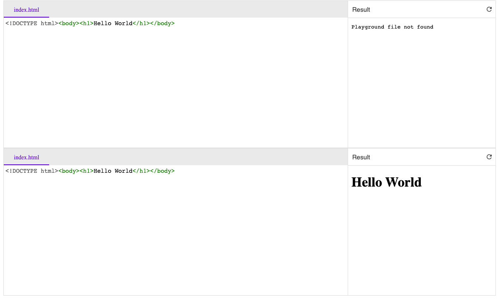

Reproducible example with long file path

## Steps

```sh
npm start
```

## Source

```js
const failure = document.createElement('playground-ide');

failure.config = {
    files: {
        "some/long/path/to/file.html": {
            content: `<!DOCTYPE html><body><h1>Hello World</h1></body>`,
            label: "index.html"
        }
    }
}

document.body.appendChild(failure);

const success = document.createElement('playground-ide');

success.config = {
    files: {
        "index.html": {
            content: `<!DOCTYPE html><body><h1>Hello World</h1></body>`,
            label: "index.html"
        }
    }
}

document.body.appendChild(success);
```

The `failure` playground result is `Playground file not found`.

## Screenshot


